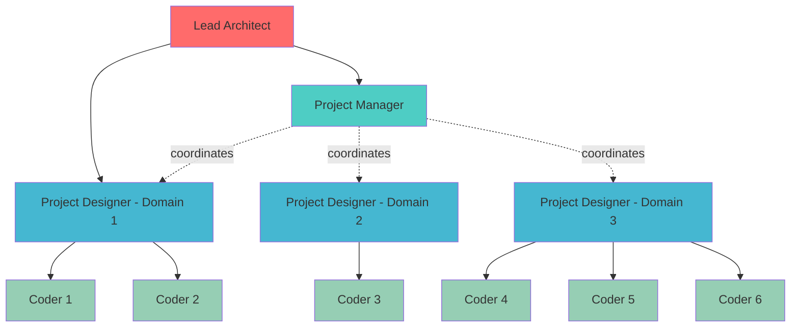
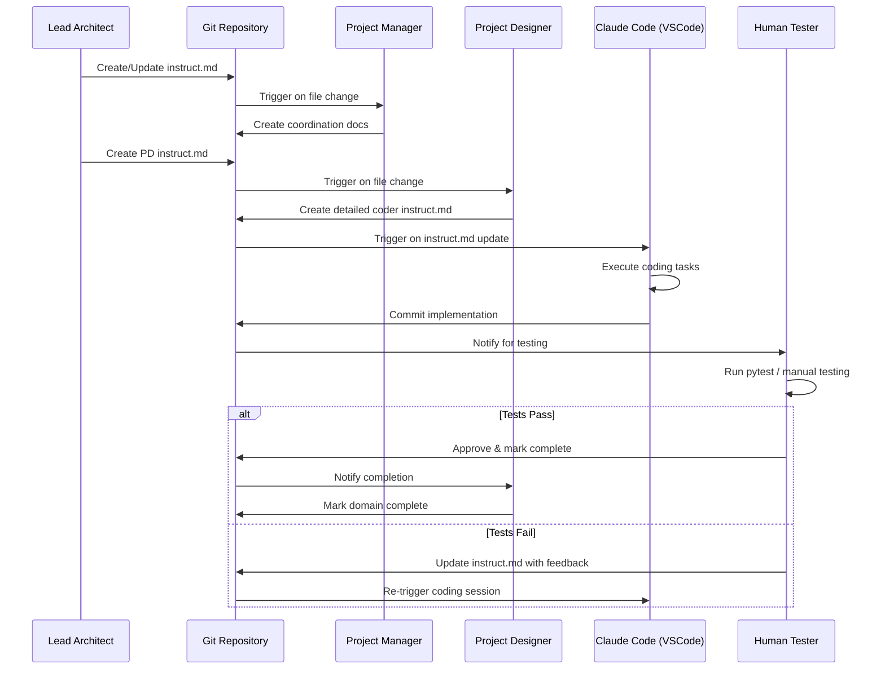
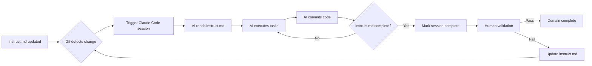
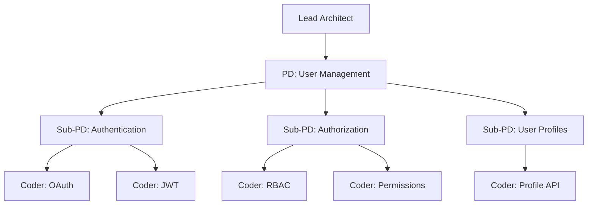
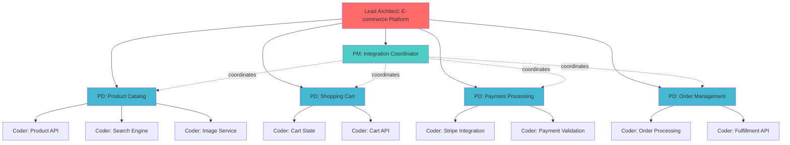

# AI-Assisted Development Framework

## Overview

A hierarchical, git-driven framework for managing complex software development using AI coding assistants (Claude Code). The system automatically partitions complexity across multiple AI sessions, enabling parallel development through domain-based decomposition.

## Core Principles

- **Bounded Context**: Each AI session operates within a clearly defined scope via `instruct.md` files
- **Git-Triggered Execution**: Code changes to instruction files automatically trigger AI coding sessions
- **Hierarchical Decomposition**: Complexity naturally partitions along feature domain boundaries
- **Human-in-the-Loop Quality**: Human testing validates completion before integration

## Organizational Structure



## Role Definitions

### Lead Architect(s)
- **Responsibility**: Define overall project direction and architecture
- **Output**: Creates initial Project Designer(s) via `instruct.md` files
- **Scope**: Global project vision and high-level technical decisions

### Project Manager(s)
- **Responsibility**: Coordinate between Project Designer domains
- **Trigger**: Automatically required when n+1 Project Designers exist
- **Output**: Integration requirements, interface contracts, cross-domain coordination
- **Scope**: Inter-domain communication and dependency management

### Project Designer(s)
- **Responsibility**: Generate detailed implementation instructions for specific feature domains
- **Output**: Domain-specific `instruct.md` with precise coder instructions
- **Scope**: Single feature domain
- **Ratio**: 1 PD per feature domain

### Coder(s)
- **Responsibility**: Implement code according to their PD's instructions
- **Output**: Working code that satisfies `instruct.md` requirements
- **Scope**: Subset of tasks within a single domain
- **Ratio**: n coders per PD (flexible based on workload)

## Workflow



## File Structure

```
project-root/
├── instruct.md                          # Lead Architect instructions
├── pm/
│   └── instruct.md                      # Project Manager coordination
├── domains/
│   ├── authentication/
│   │   ├── instruct.md                  # PD instructions for auth domain
│   │   ├── coders/
│   │   │   ├── coder-1-instruct.md     # Specific coder tasks
│   │   │   └── coder-2-instruct.md
│   │   └── src/                         # Implementation code
│   ├── payments/
│   │   ├── instruct.md
│   │   ├── coders/
│   │   │   └── coder-1-instruct.md
│   │   └── src/
│   └── analytics/
│       ├── instruct.md
│       └── src/
└── integration/
    └── tests/                           # Cross-domain integration tests
```

## Git-Driven Automation



## Completion Criteria

Each role is considered "done" when:

1. **Lead Architect**: All necessary PDs have been spawned with clear instruct.md files
2. **Project Manager**: All inter-domain interfaces are defined and documented
3. **Project Designer**: Detailed coder instructions are complete and unambiguous
4. **Coder**: All tasks in instruct.md are implemented and committed

**Final validation**: Human tester confirms functionality via pytest or manual testing

## Scalability & Fractal Growth

The framework supports recursive depth:



When a domain becomes too complex, a PD can spawn sub-PDs, creating deeper hierarchies while maintaining bounded context for each AI session.

## Technology Stack

- **AI Engine**: Claude Code (via VSCode extension)
- **Version Control**: Git (triggers automation)
- **Testing**: pytest + human validation
- **Documentation**: Markdown (instruct.md files)
- **Orchestration**: Git hooks / CI/CD watching instruct.md changes

## Benefits

### Complexity Management
- Each AI session has a clear, bounded scope
- Natural decomposition along domain boundaries
- Self-documenting architecture via instruct.md files

### Parallelization
- Multiple PD-Coder groups work independently
- No coordination overhead within domains
- PM handles only inter-domain concerns

### Quality Control
- Human-in-the-loop testing ensures quality
- Git history provides full audit trail
- Clear completion criteria prevent scope creep

### Scalability
- Fractal structure grows with project complexity
- New domains easily added without restructuring
- Can handle projects of arbitrary size

## Example: E-commerce Project



## Getting Started

1. Lead Architect creates root `instruct.md` defining project vision
2. Lead Architect creates domain folders with PD `instruct.md` files
3. If multiple domains exist, create PM with coordination `instruct.md`
4. PDs create detailed coder `instruct.md` files
5. Git hook triggers Claude Code on instruct.md changes
6. Coders implement and commit code
7. Human tests and validates
8. Rinse and repeat until project complete

---

*This framework enables systematic AI-assisted development at scale while maintaining human oversight and quality control.*
