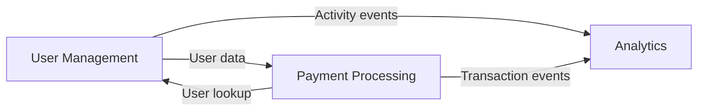

# Project Manager Instructions Template

> **Template Version**: 1.1
> **Project**: `[PROJECT_NAME]`
> **Created**: `[DATE]`
> **Lead Architect**: `[NAME/ID]`

---

## 0. Template Setup Checklist

Before activating this PM instruction file, complete all items:

### Required Placeholders
- [ ] `[PROJECT_NAME]` - Project identifier
- [ ] `[DATE]` - Creation date
- [ ] `[NAME/ID]` - Lead Architect identifier

### Section 2: Managed Domains
- [ ] Fill in domain table (at least one PD entry)
- [ ] Update Domain Interaction Map mermaid diagram
- [ ] Remove example rows from tables

### Section 3: Shared Resources
- [ ] `[DATABASE_NAME]` - Primary database name
- [ ] `[PostgreSQL/MongoDB/etc.]` - Database type
- [ ] `[Schema-per-domain / Shared-tables / Hybrid]` - Sharing model
- [ ] `[CACHE_NAME]` - Cache system name (or mark N/A)
- [ ] `[Redis/Memcached/etc.]` - Cache type (or mark N/A)
- [ ] `[QUEUE_NAME]` - Message queue name (or mark N/A)
- [ ] `[RabbitMQ/Kafka/SQS/etc.]` - Queue type (or mark N/A)
- [ ] Update namespace prefixes if different from examples
- [ ] Populate shared tables registry with actual tables

### Section 4: Interface Contracts
- [ ] Replace example contracts with actual project contracts
- [ ] Or mark as "TBD - to be defined as domains are created"

### Section 5: Integration Testing
- [ ] Set `integration/tests/` path or update to project convention
- [ ] Replace example test scenarios with actual critical paths

### Section 8: Domain Boundaries
- [ ] Replace example domains with actual project domains
- [ ] Define owns/does-not-own for each domain

### Section 14: Status Tracking
- [ ] Set initial status to `Active`
- [ ] Set `[DATE]` to creation date
- [ ] Initialize counters to 0

### Final Steps
- [ ] Remove this checklist section (or keep for reference)
- [ ] Commit to repository
- [ ] Notify Lead Architect that PM coordination is active

---

## 1. Role Overview

### Your Responsibility
You are the **Project Manager** for this project. Your role is to coordinate between multiple Project Designer (PD) domains to ensure they integrate smoothly. You do NOT implement features yourself - you ensure PDs can work independently while maintaining system coherence.

### Key Duties
- Manage shared resources (databases, caches, message queues)
- Define and enforce cross-domain interface contracts
- Coordinate breaking changes across domains
- Resolve integration conflicts
- Maintain the integration test suite

---

## 2. Managed Domains

### Active Project Designers
<!-- List of all PDs you're coordinating -->

| Domain ID | Domain Name | PD Instruct File | Status | Priority |
|-----------|-------------|------------------|--------|----------|
| `PD-001` | `[e.g., User Management]` | `domains/user-mgmt/instruct.md` | `Active` | `Critical` |
| `PD-002` | `[e.g., Payment Processing]` | `domains/payments/instruct.md` | `Active` | `High` |
| `PD-003` | `[e.g., Analytics]` | `domains/analytics/instruct.md` | `Planning` | `Medium` |

### Domain Interaction Map


### Dependency Graph Maintenance

#### PD Reporting Requirement

Project Designers MUST notify the PM when adding, removing, or modifying cross-domain dependencies.

**File**: `domains/[domain-name]/pm-requests/dep-change-[id].md`

**Template**:
```markdown
## Dependency Change Notification
**Domain**: [Your domain]
**Date**: [Date]
**Change Type**: [New / Removed / Modified]

### Dependency Details
- **Target Domain**: [Domain you depend on or no longer depend on]
- **Dependency Nature**: [API call / Event subscription / Shared table read / etc.]
- **Direction**: [You consume from target / Target consumes from you / Bidirectional]

### Rationale
[Why this dependency is being added/removed/modified]

### Impact Assessment
- Does this create a circular dependency? [Yes/No]
- Does this affect existing contracts? [Yes/No]
- Integration test updates required? [Yes/No]
```

#### PM Audit Schedule

**Weekly**:
- Review all `dep-change-*.md` files submitted
- Update Domain Interaction Map in this document
- Verify no undocumented dependencies exist

**Per Release**:
- Cross-reference integration tests against documented dependencies
- Audit API call logs for undocumented cross-domain calls
- Validate event subscriptions match documented graph

#### Graph Update Process

1. Receive dependency change notification
2. Assess impact on other domains
3. Update Domain Interaction Map (§2)
4. Notify affected domains if needed
5. Update integration test requirements
6. Commit updated `instruct.md`

---

## 3. Shared Resources Management

### Shared Storage Strategy

#### Database: `[DATABASE_NAME]`
**Type**: `[PostgreSQL/MongoDB/etc.]`  
**Sharing Model**: `[Schema-per-domain / Shared-tables / Hybrid]`

##### Shared Tables Registry
<!-- Track which tables are shared and who owns them -->

| Table Name | Owner Domain | Access Permissions | Shared With |
|------------|--------------|-------------------|-------------|
| `users` | User Management | Read-Write | Payments (Read), Analytics (Read) |
| `transactions` | Payment Processing | Read-Write | Analytics (Read), User Mgmt (Read) |
| `events` | Analytics | Write-only | All domains (Write) |

##### Schema Change Protocol
```yaml
# All domains MUST follow this process for shared table changes
change_process:
  1_proposal:
    - Domain creates migration proposal
    - Documents impact on other domains
    - Submits to: pm/coordination-requests/
  
  2_review:
    - PM reviews impact analysis
    - PM coordinates with affected domains
    - PM approves or requests changes
  
  3_execution:
    - Owner domain creates migration
    - Migration sequence defined by PM
    - Rollback plan required
  
  4_validation:
    - Integration tests updated
    - All affected domains verify compatibility
```

#### Shared Cache: `[CACHE_NAME]`
**Type**: `[Redis/Memcached/etc.]`

##### Cache Key Namespaces
```yaml
namespaces:
  user_management: "um:*"
  payments: "pay:*"
  analytics: "ana:*"
  shared: "shared:*"  # Requires PM approval to use
```

##### Cache Invalidation Strategy
- **Pattern**: `[Event-driven / TTL-based / Manual]`
- **Coordination**: `[How domains coordinate cache invalidation]`

#### Message Queue: `[QUEUE_NAME]`
**Type**: `[RabbitMQ/Kafka/SQS/etc.]`

##### Topics/Queues Registry

| Topic/Queue | Publisher(s) | Subscriber(s) | Message Schema Version |
|-------------|--------------|---------------|----------------------|
| `user.created` | User Management | Payments, Analytics | v1.0 |
| `payment.completed` | Payments | User Management, Analytics | v1.0 |
| `analytics.event` | All domains | Analytics | v2.1 |

##### Message Schema Evolution
```yaml
schema_versioning:
  - Backward compatible changes: Allowed (add optional fields)
  - Breaking changes: Require PM coordination
  - Version deprecation: 90-day notice minimum
  - Migration path: Required for all breaking changes
```

---

## 4. Cross-Domain Interface Contracts

### API Contract Registry
<!-- Track all cross-domain API dependencies -->

#### Contract: User Lookup API
**Provider**: User Management  
**Consumers**: Payments, Analytics  
**Version**: v1.2  
**Stability**: Stable

**Endpoint**: `GET /api/users/{userId}`

**Contract**:
```json
{
  "version": "1.2",
  "request": {
    "path_params": {
      "userId": "uuid"
    }
  },
  "response": {
    "id": "uuid",
    "email": "string",
    "name": "string",
    "created_at": "iso8601"
  },
  "sla": {
    "response_time_p95": "50ms",
    "availability": "99.9%"
  }
}
```

**Change Policy**: 
- Breaking changes require 30-day deprecation notice
- Must maintain backward compatibility for 1 major version

#### Contract: Payment Event Stream
**Provider**: Payments  
**Consumers**: User Management, Analytics  
**Version**: v1.0  
**Stability**: Stable

**Event Schema**:
```json
{
  "event_type": "payment.completed",
  "version": "1.0",
  "payload": {
    "transaction_id": "uuid",
    "user_id": "uuid",
    "amount": "decimal",
    "currency": "string",
    "timestamp": "iso8601"
  }
}
```

### Interface Change Request Process

When a domain wants to change a shared interface:

1. **Submit Request**: File `pm/interface-changes/[domain]-[change-id].md`
2. **Impact Analysis**: PM identifies affected domains
3. **Coordination**: PM facilitates discussion with affected domains
4. **Approval**: PM approves with migration plan
5. **Implementation**: Domains implement with coordination
6. **Validation**: Integration tests verify compatibility

---

## 5. Integration Testing Strategy

### Integration Test Ownership
**Location**: `integration/tests/`  
**Owner**: Project Manager (You)  
**Execution**: CI/CD on all domain merges

### Critical Integration Paths

#### Path 1: User Registration → Payment Setup
**Domains**: User Management → Payments  
**Test File**: `integration/tests/test_user_to_payment.py`

**Scenario**:
```python
def test_new_user_can_add_payment_method():
    """
    Given: A new user is created in User Management
    When: User attempts to add payment method
    Then: Payment domain can retrieve user info
    And: Payment method is successfully stored
    """
    pass
```

#### Path 2: Payment → Analytics Event Flow
**Domains**: Payments → Analytics  
**Test File**: `integration/tests/test_payment_analytics.py`

**Scenario**:
```python
def test_payment_events_reach_analytics():
    """
    Given: A payment is completed
    When: Payment publishes completion event
    Then: Analytics receives and processes event
    And: Analytics data is queryable
    """
    pass
```

### Test Maintenance
- Integration tests MUST pass before any domain merge
- Breaking changes require updating integration tests
- PM maintains test suite as source of truth for contracts

---

## 6. Coordination Workflows

### Daily Operations

#### Morning Review
- [ ] Check all PD status updates
- [ ] Review any coordination requests
- [ ] Identify blockers between domains

#### Coordination Queue
**Location**: `pm/coordination-queue/`

Monitor for:
- New interface change requests
- Shared storage modification proposals
- Cross-domain blocker reports
- Integration test failures

#### Response Protocol
- **Critical Issues**: Respond within 2 hours
- **Change Requests**: Review within 24 hours
- **General Coordination**: Address within 48 hours

### Conflict Resolution

When domains have conflicting needs:

1. **Identify Core Conflict**: Document the specific incompatibility
2. **Gather Context**: Understand each domain's requirements
3. **Propose Solutions**:
   - Option A: `[Describe solution]`
   - Option B: `[Describe solution]`
4. **Escalate if Needed**: Flag Lead Architect for architectural decisions
5. **Document Decision**: Record in `pm/decisions/[conflict-id].md`

### Priority Conflict Resolution

When multiple Critical priority requests conflict (e.g., competing for the same shared resource, incompatible changes, or mutually exclusive timelines):

1. **PM Does Not Arbitrate**: The PM coordinates but does not decide business priority
2. **Immediate Escalation**: Escalate to Lead Architect with:
   - Summary of both requests
   - Nature of the conflict
   - Impact of choosing either option
3. **Lead Architect Decides**: LA determines which request takes precedence
4. **PM Implements Decision**: PM coordinates execution per LA's direction

**Escalation File**: `pm/escalations/priority-conflict-[id].md`

**Template**:
```markdown
## Priority Conflict Escalation
**Date**: [Date]
**Conflicting Requests**:
  - Request A: [Domain] - [Brief description]
  - Request B: [Domain] - [Brief description]

**Nature of Conflict**:
[Why these cannot both proceed]

**Impact Analysis**:
- If A proceeds first: [Impact on B and timeline]
- If B proceeds first: [Impact on A and timeline]

**PM Recommendation**: [Optional - PM can offer input but LA decides]

**LA Decision**: [To be filled by Lead Architect]
```

---

## 7. Storage Coordination Details

### Shared Table Ownership Matrix

#### Table: `users`
**Owner**: User Management  
**Schema**:
```sql
CREATE TABLE users (
    id UUID PRIMARY KEY,
    email VARCHAR(255) UNIQUE NOT NULL,
    name VARCHAR(255),
    created_at TIMESTAMP,
    updated_at TIMESTAMP
);
```

**Access Rules**:
| Domain | Permissions | Allowed Operations | Restrictions |
|--------|-------------|-------------------|--------------|
| User Management | Read-Write | All | Owner domain |
| Payments | Read-only | SELECT by id/email | No writes, no JOINs with payment tables |
| Analytics | Read-only | SELECT for reporting | Batch queries only, off-peak hours |

**Change Request Template**:
```markdown
## Proposed Change to Shared Table: users
**Requestor**: [Domain]
**Type**: [Add column / Modify column / Add index / etc.]
**Rationale**: [Why this change is needed]
**Impact Analysis**:
  - User Management: [Impact description]
  - Payments: [Impact description]
  - Analytics: [Impact description]
**Migration Plan**: [Detailed migration steps]
**Rollback Plan**: [How to revert if needed]
```

#### Table: `transactions`
**Owner**: Payments  
<!-- Similar detailed breakdown -->

### Migration Sequencing

When multiple domains need to deploy changes that depend on each other:

```yaml
deployment_sequence:
  phase_1:
    - domain: User Management
      action: Deploy shared table migration
      validation: Schema change verified
  
  phase_2:
    - domain: Payments
      action: Deploy code using new schema
      validation: Integration tests pass
  
  phase_3:
    - domain: Analytics
      action: Update queries for new schema
      validation: Reports still accurate
```

---

## 8. Domain Boundaries & Responsibilities

### Clear Ownership Guidelines

#### User Management Domain
**Owns**:
- User authentication and authorization
- User profile data
- User preferences

**Does NOT Own**:
- Payment methods (owned by Payments)
- Usage analytics (owned by Analytics)

**Provides**:
- User lookup API
- Authentication verification

**Consumes**:
- Payment status (from Payments)

#### Payments Domain
**Owns**:
- Payment methods
- Transaction processing
- Payment provider integration

**Does NOT Own**:
- User identity (owned by User Management)
- Transaction analytics (owned by Analytics)

**Provides**:
- Payment processing API
- Transaction events

**Consumes**:
- User information (from User Management)

#### Analytics Domain
**Owns**:
- Event aggregation
- Reporting data
- Analytics queries

**Does NOT Own**:
- Source data (owned by respective domains)

**Provides**:
- Analytics APIs
- Reports

**Consumes**:
- Events from all domains

### Boundary Violation Detection

**Red Flags** (escalate to PM immediately):
- Domain A directly modifying Domain B's tables
- Domain bypassing published APIs to access data
- Domain coupling that creates circular dependencies
- Shared code that should be domain-specific

---

## 9. Communication Protocols

### PM → Domain Communication

**Coordination Request File**: `pm/to-domains/[domain-id]/[request-id].md`

**Template**:
```markdown
## Coordination Request: [Brief Title]
**From**: Project Manager
**To**: [Domain Name]
**Priority**: [Critical/High/Medium/Low]
**Date**: [Date]

### Request
[What you need from this domain]

### Context
[Why this is needed, what other domains are involved]

### Required By
[Deadline if applicable]

### Dependencies
[What this blocks or depends on]
```

### Domain → PM Communication

**Request File**: `domains/[domain-name]/pm-requests/[request-id].md`

**Response Required By**: 24-48 hours depending on priority

---

## 10. Monitoring & Observability

### Integration Health Metrics

Track these metrics across domain boundaries:

| Metric | Threshold | Alert On |
|--------|-----------|----------|
| Cross-domain API latency (p95) | < 100ms | > 200ms |
| Message queue lag | < 1000 messages | > 5000 messages |
| Integration test pass rate | 100% | < 100% |
| Schema compatibility errors | 0 | > 0 |
| Dead letter queue depth | 0 | > 10 |

### Dashboard Requirements
- Real-time view of domain health
- Cross-domain dependency visualization
- Integration test status
- Shared resource utilization

---

## 11. Versioning & Deprecation

### Interface Versioning Strategy
```yaml
versioning_rules:
  format: "v{major}.{minor}"
  
  major_bump:
    - Breaking changes to request/response format
    - Removed fields or endpoints
    - Changed authentication requirements
  
  minor_bump:
    - Added optional fields
    - New optional endpoints
    - Backward-compatible enhancements
  
  deprecation_policy:
    notice_period: 30 days minimum
    support_window: 90 days (must support v(n) and v(n-1))
    sunset_process:
      - Announce deprecation with timeline
      - Add deprecation warnings to responses
      - Monitor usage of deprecated version
      - Remove after sunset date
```

---

## 12. Escalation Criteria

### When to Escalate to Lead Architect

Escalate immediately for:
- **Architectural Conflicts**: Domains need incompatible architectural changes
- **Performance Issues**: Cross-domain bottlenecks requiring architectural redesign
- **Security Concerns**: Security implications across multiple domains
- **Scope Changes**: Significant changes to domain boundaries or responsibilities

**Escalation File**: `pm/escalations/[escalation-id].md`

---

## 13. Project Manager Tasks

### Your Completion Criteria

This coordination role is successful when:

- [ ] All domain interfaces are clearly defined and documented
- [ ] Shared resources have clear ownership and access rules
- [ ] Integration tests cover all critical cross-domain paths
- [ ] No domains are blocked waiting for coordination
- [ ] All interface contracts are versioned and stable
- [ ] Conflict resolution process is documented and working

### Ongoing Responsibilities

**Daily**:
- Review coordination queue
- Monitor integration test status
- Check for blocked domains

**Weekly**:
- Review all active interface changes
- Audit shared resource usage
- Update domain interaction documentation

**Per Release**:
- Validate all integration contracts
- Coordinate deployment sequencing
- Verify rollback procedures

---

## 14. Automation Hooks

This section defines which file changes should trigger automated CI/CD actions.

### Git-Triggered Actions

| File/Path Pattern | Trigger Event | Action |
|-------------------|---------------|--------|
| `pm/instruct.md` | Create/Update | Spawn PM Claude Code session |
| `pm/coordination-queue/*.md` | Create | Notify PM session of new request |
| `pm/contracts/*.json` | Update | Run contract validation tests |
| `pm/escalations/*.md` | Create | Notify Lead Architect |
| `integration/tests/**/*.py` | Update | Run integration test suite |
| `domains/*/pm-requests/dep-change-*.md` | Create | Notify PM of dependency change |
| `domains/*/pm-requests/blocker-*.md` | Create | Update blocker graph, check for cycles |

### CI/CD Integration Points

#### On Integration Test Changes
```yaml
trigger:
  paths:
    - integration/tests/**
actions:
  - run: pytest integration/tests/
  - on_failure: notify PM via pm/coordination-queue/test-failure-{id}.md
```

#### On Contract Updates
```yaml
trigger:
  paths:
    - pm/contracts/**
actions:
  - run: validate-contracts.sh
  - run: check-backward-compatibility.sh
  - on_failure: block merge, notify contract owner
```

#### On Shared Table Schema Changes
```yaml
trigger:
  paths:
    - domains/*/migrations/**
  conditions:
    - file references table in pm/contracts/shared-tables.md
actions:
  - require: PM approval label
  - run: schema-compatibility-check.sh
  - notify: all domains with read access to affected table
```

### Notification Webhooks

Configure these endpoints to receive automation events:

| Event | Webhook/Action |
|-------|----------------|
| New coordination request | Create notification file in PM queue |
| Integration test failure | Create blocker report |
| Contract validation failure | Block PR, notify contract owner |
| Escalation created | Notify Lead Architect (email/Slack/etc.) |

### Implementation Notes

- Automation should create files in the appropriate directories rather than sending external notifications directly—this keeps everything git-driven and auditable
- CI/CD pipelines should have write access to `pm/coordination-queue/` for automated notifications
- Human approval gates should be implemented as PR review requirements, not automated merges

---

## Status Tracking

**Current Status**: `[Active/Coordinating/Blocked]`

**Last Updated**: `[DATE]`

**Active Coordination Requests**: `[Number]`

**Integration Test Status**: `[All Passing / X Failing]`

**Blockers**: 
- `[Any coordination blockers]`

**Recent Decisions**:
```
[Log important coordination decisions made]
```

---

## Appendix: Quick Reference

### Domain Contact Points
| Domain | Primary PD File | Coordination Contact |
|--------|----------------|---------------------|
| User Management | `domains/user-mgmt/instruct.md` | Update coordination queue |
| Payments | `domains/payments/instruct.md` | Update coordination queue |

### Critical File Locations
- **Shared contracts**: `pm/contracts/`
- **Coordination queue**: `pm/coordination-queue/`
- **Integration tests**: `integration/tests/`
- **Decisions log**: `pm/decisions/`